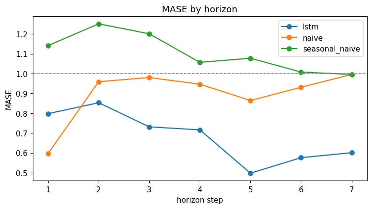
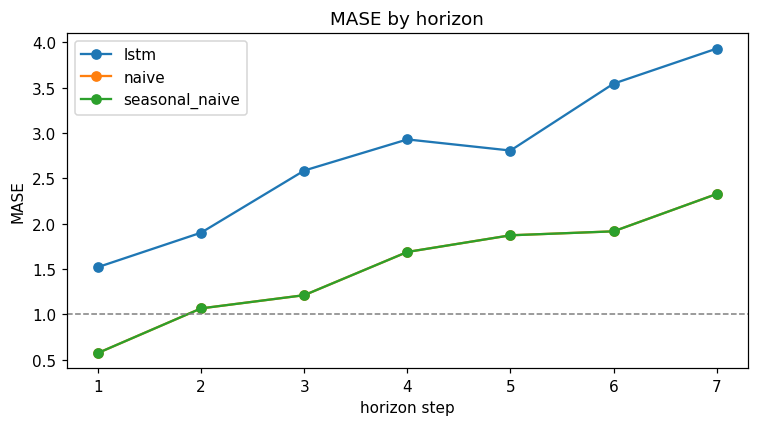

# LSTM Forecaster

Multistep demand & financial forecasting with a stacked PyTorch LSTM — measured **honestly** against classic baselines (naive, seasonal-naive, ARIMA) under strict, **leak-free, time-ordered** validation, so the deep model only gets credit when it actually earns it.

> **Not investment advice.** Public + synthetic data only; not connected to any employer system.

Part of [hector-garza.com](https://hector-garza.com)'s portfolio. One of three equal deliverables: the app, a **Decision Record** ([`DECISIONS.md`](./DECISIONS.md)), and a recorded whiteboard session. A working model no longer proves competence — the judgment behind it does. See [`SPEC.md`](./SPEC.md) §0.

## The honest result (this is the point)

The deep model is a *participant*, not a foregone conclusion. Run through the **same** leak-free walk-forward harness as the baselines, it **wins where the structure warrants it and loses where it doesn't — and the verdict says so, per horizon.**

**Synthetic demand** (weekly + monthly seasonality, AR(1) noise, shocks) — structure a single-lag baseline can't capture:

> `VERDICT: lstm BEATS seasonal_naive overall (mean MASE 0.682 vs 1.104, -38.2%).`



**AAPL realized volatility** — smooth and highly persistent, where "tomorrow ≈ today" is genuinely hard to beat:

> `VERDICT: lstm LOSES to seasonal_naive overall (mean MASE 2.746 vs 1.523, +80.3%).`



MASE is the headline because it is **scale-free and baseline-relative**: MASE < 1 beats the naive forecast, ≥ 1 does not. Reporting the loss on volatility — rather than tuning until the deep model "wins" — is the hireable signal: *you can be trusted with time-dependent data.*

## What it does

- Forecasts a series **multiple steps ahead** with a stacked LSTM (direct multi-horizon).
- **Always** compares against naive, seasonal-naive, and ARIMA baselines.
- **Leak-free evaluation:** time-ordered walk-forward, **train-only scaling**, fixed forecast origin — enforced by a `test_no_leakage` suite that runs in CI.
- Honest scoreboard: **MASE** (vs. naive), RMSE, MAE — per model, per horizon — plus residual prediction intervals and a plain-language verdict (including where the LSTM *loses*).

## Run it locally

```bash
pip install -e ".[dev]"      # runtime + dev deps (CPU torch)
pytest                       # the whole leak-free test suite
python -m app.app            # launch the Gradio demo at http://127.0.0.1:7860
```

Pick a dataset → **Run backtest** → forecast-vs-actual (baseline overlaid), MASE-by-horizon, the verdict, and the per-horizon scoreboard. The LSTM trains on the fly on the pre-origin region (~10–30s on CPU); nothing trains until you click Run.

Reproducible training entrypoint (writes a checkpoint + metrics JSON):

```bash
python -m src.train          # -> checkpoints/model.pt + checkpoints/metrics.json
```

## Data & provenance (be honest about limits)

- **Synthetic demand:** a seeded, fully reproducible generator (trend + weekly & monthly seasonality + AR(1) noise + occasional shocks). Obviously synthetic; it exists to give the model a series with *learnable* structure a one-line baseline can't capture.
- **AAPL realized volatility:** rolling standard deviation of daily log returns, computed from a small **public** AAPL daily-close sample (2022–2024) committed at [`app/samples/aapl_close.csv`](./app/samples/aapl_close.csv) so the demo runs fully offline. It forecasts **volatility, not price** — price level is ~a random walk; volatility is persistent and more forecastable. Framed as *method*, never a market-beating claim.
- **No employer data.** No API keys required.

## Architecture

```
src/data/   leak-free harness: synthetic generator, windowing, time-split, train-only scaler, loaders
src/models/ baselines (naive / seasonal-naive), ARIMA (AIC grid), stacked LSTM (PyTorch)
src/eval/   walk_forward (rolling origin), metrics (MASE/RMSE/MAE), intervals, scoreboard, verdict, plots
src/train.py reproducible seeded training + checkpoint/metrics + the walk-forward forecaster adapter
app/        datasets registry, the end-to-end evaluation pipeline, and the Gradio UI
```

The walk-forward engine hands every model only data *before* the forecast origin, so leak-freeness is structural and the baselines and the LSTM are scored identically. See [`SPEC.md`](./SPEC.md) §6–7 and [`DECISIONS.md`](./DECISIONS.md).

- **Modeling:** PyTorch (stacked LSTM) · statsmodels (ARIMA) · pandas / numpy
- **Demo:** Gradio · **Host:** Hugging Face Spaces · **Tooling:** Python 3.12 · ruff + pytest · GitHub Actions CI

> Stack note: a deliberate deviation from the portfolio's Django/Render default — **Gradio + Hugging Face Spaces** is where ML demos live and signals ecosystem fluency.

## Deploy to Hugging Face Spaces

The repo is Space-ready: [`space_app.py`](./space_app.py) is the entrypoint (set in the front-matter above), [`requirements.txt`](./requirements.txt) carries the CPU runtime deps, and gradio is provided by the Space via `sdk_version`.

```bash
# one-time: create a Gradio Space and push this repo to it
huggingface-cli login
huggingface-cli repo create lstm-forecaster --type space --space_sdk gradio
git remote add space https://huggingface.co/spaces/<your-username>/lstm-forecaster
git push space main
```

The Space builds from the front-matter + `requirements.txt`. If the build complains about the gradio version, bump `sdk_version` to one HF offers (the app uses only stable gradio APIs). Free CPU tier is fine — inference and the small on-the-fly training both run on CPU.

## Links

- 🔗 Live demo (HF Space): _add after first `git push space main`_
- 🧠 Decision record: [`DECISIONS.md`](./DECISIONS.md)
- 🎥 Whiteboard walkthrough: _TBD (M8)_
- 🗺️ Build plan: [`PLAN.md`](./PLAN.md) (M0 → M8)
